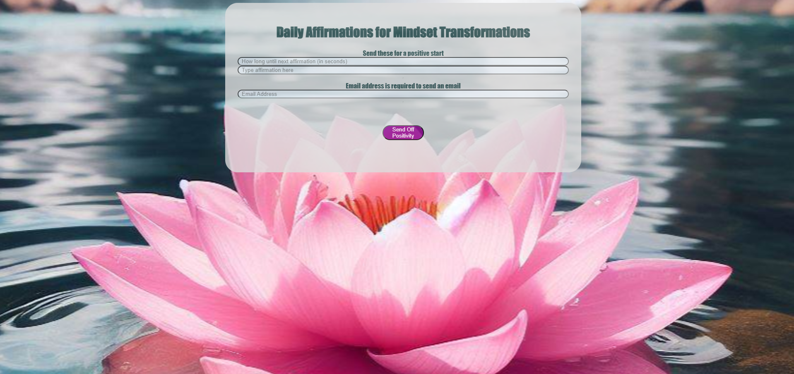

# Daily Affirmations Serverless Application

## Description

This is an application intended to send out positive affirmations via email. Affirmations can help shift your mindset to see things in a positive way resulting in having a happier, more confident, and lower-stress life.

In order to use this application, you enter the amount of time you would like to send the message, the message itself, and the email address of the recipient. Once you submit your positive message, you will see the status of message.

For demo purposes, I configured my simple email services (SES) to my email as the recepient.

    

## Technologies
   
   AWS: S3, static hosting, API gateway, API Lambda, state machine, simple email services (SES), IAM, and cloudformation.

   Front-End: HTML, CSS, and JavaScript

## Questions or Suggestions

Any questions can be sent to me via Github at:
    https://github.com/hallkr86

## Link

http://dailyaffirmations4321.s3-website-us-east-1.amazonaws.com

## License

This project is licensed under the MIT license.